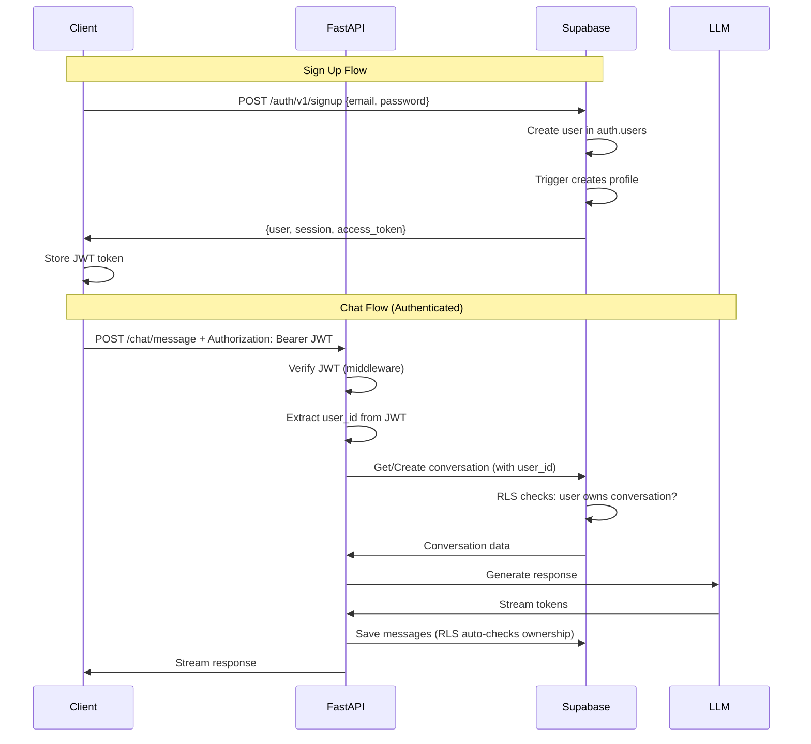

# Supabase Integration Guide for Novus-Chat

> **Complete beginner-friendly guide** for integrating Supabase authentication and database into your ChatGPT clone

---

## Table of Contents
1. [What is Supabase?](#what-is-supabase)
2. [Step-by-Step Account & Project Setup](#step-by-step-account--project-setup)
3. [Understanding Supabase Components](#understanding-supabase-components)
4. [Authentication Flow Architecture](#authentication-flow-architecture)
5. [Integration with Your Existing Code](#integration-with-your-existing-code)
6. [Implementation Roadmap](#implementation-roadmap)

---

## What is Supabase?

**Supabase** is an open-source Firebase alternative that provides:
- **PostgreSQL Database**: Fully managed, with real-time capabilities
- **Authentication**: Built-in user management (email/password, OAuth, magic links)
- **Row Level Security (RLS)**: Database-level authorization
- **Storage**: File uploads and management
- **Edge Functions**: Serverless functions
- **Real-time subscriptions**: Live data updates

### Why Supabase for Novus-Chat?

✅ **Replaces your current PostgreSQL** - Already have schema designed  
✅ **Built-in authentication** - No need to build from scratch  
✅ **Row Level Security** - Users can only access their own conversations  
✅ **Python SDK** - Easy integration with FastAPI  
✅ **Free tier** - Generous limits for development  

---

## Step-by-Step Account & Project Setup

### Step 1: Create Supabase Account

1. **Go to** [https://supabase.com](https://supabase.com)
2. **Click** "Start your project" or "Sign Up"
3. **Sign up using**:
   - GitHub (recommended - fastest)
   - Email/password
   - Google
   - GitLab

> 💡 **Tip**: Use GitHub for easier integration with CI/CD later

### Step 2: Create Your First Project

After signing in, you'll see the dashboard:

1. **Click** "New Project"
2. **Fill in project details**:
   ```
   Name: novus-chat
   Database Password: [Generate a strong password - SAVE THIS!]
   Region: Choose closest to you (e.g., US East, EU West, Asia Southeast)
   Pricing Plan: Free (perfect for development)
   ```
3. **Click** "Create new project"
4. **Wait 2-3 minutes** for provisioning

> ⚠️ **IMPORTANT**: Save your database password! You'll need it for direct connections.

### Step 3: Get Your API Credentials

Once your project is ready:

1. **Go to** Project Settings (gear icon in sidebar)
2. **Click** "API" in the settings menu
3. **Copy these values** (you'll need them):

   ```bash
   # Project URL
   SUPABASE_URL=https://xxxxxxxxxxxxx.supabase.co
   
   # Anon/Public Key (safe for client-side)
   SUPABASE_ANON_KEY=eyJhbGciOiJIUzI1NiIsInR5cCI6IkpXVCJ9...
   
   # Service Role Key (SECRET - server-side only!)
   SUPABASE_SERVICE_KEY=eyJhbGciOiJIUzI1NiIsInR5cCI6IkpXVCJ9...
   ```

4. **Add to your `.env` file**:
   ```bash
   # Supabase Configuration
   SUPABASE_URL=https://xxxxxxxxxxxxx.supabase.co
   SUPABASE_ANON_KEY=your_anon_key_here
   SUPABASE_SERVICE_KEY=your_service_key_here
   ```

> 🔒 **Security Note**: 
> - `ANON_KEY`: Can be exposed in frontend (has RLS restrictions)
> - `SERVICE_KEY`: NEVER expose! Bypasses RLS. Backend only.

### Step 4: Set Up Your Database Schema

You already have a schema in `db/init.sql`. Let's migrate it to Supabase:

1. **Go to** SQL Editor (in sidebar)
2. **Click** "New Query"
3. **Copy your existing schema** from `backend/db/init.sql`
4. **Modify slightly** for Supabase (see below)
5. **Run the query**

**Modified Schema for Supabase**:

```sql
-- Supabase already has auth.users table, so we'll extend it
-- Create a public.profiles table that references auth.users

-- =====================
-- USER PROFILES (extends auth.users)
-- =====================
CREATE TABLE public.profiles (
    id UUID PRIMARY KEY REFERENCES auth.users(id) ON DELETE CASCADE,
    email TEXT,
    full_name TEXT,
    avatar_url TEXT,
    created_at TIMESTAMP WITH TIME ZONE DEFAULT now(),
    updated_at TIMESTAMP WITH TIME ZONE DEFAULT now()
);

-- Enable Row Level Security
ALTER TABLE public.profiles ENABLE ROW LEVEL SECURITY;

-- Users can only read their own profile
CREATE POLICY "Users can view own profile" 
    ON public.profiles FOR SELECT 
    USING (auth.uid() = id);

-- Users can update their own profile
CREATE POLICY "Users can update own profile" 
    ON public.profiles FOR UPDATE 
    USING (auth.uid() = id);

-- =====================
-- CONVERSATIONS
-- =====================
CREATE TABLE public.conversations (
    id UUID PRIMARY KEY DEFAULT gen_random_uuid(),
    user_id UUID NOT NULL REFERENCES auth.users(id) ON DELETE CASCADE,
    title TEXT,
    created_at TIMESTAMP WITH TIME ZONE DEFAULT now(),
    updated_at TIMESTAMP WITH TIME ZONE DEFAULT now()
);

-- Enable Row Level Security
ALTER TABLE public.conversations ENABLE ROW LEVEL SECURITY;

-- Users can only see their own conversations
CREATE POLICY "Users can view own conversations" 
    ON public.conversations FOR SELECT 
    USING (auth.uid() = user_id);

-- Users can create conversations
CREATE POLICY "Users can create conversations" 
    ON public.conversations FOR INSERT 
    WITH CHECK (auth.uid() = user_id);

-- Users can update their own conversations
CREATE POLICY "Users can update own conversations" 
    ON public.conversations FOR UPDATE 
    USING (auth.uid() = user_id);

-- Users can delete their own conversations
CREATE POLICY "Users can delete own conversations" 
    ON public.conversations FOR DELETE 
    USING (auth.uid() = user_id);

CREATE INDEX idx_conversations_user_id ON public.conversations(user_id);
CREATE INDEX idx_conversations_created_at ON public.conversations(created_at);

-- =====================
-- MESSAGES
-- =====================
CREATE TABLE public.messages (
    id BIGSERIAL PRIMARY KEY,
    conversation_id UUID NOT NULL REFERENCES public.conversations(id) ON DELETE CASCADE,
    role TEXT CHECK (role IN ('system', 'user', 'assistant')),
    content TEXT NOT NULL,
    created_at TIMESTAMP WITH TIME ZONE DEFAULT now()
);

-- Enable Row Level Security
ALTER TABLE public.messages ENABLE ROW LEVEL SECURITY;

-- Users can view messages from their conversations
CREATE POLICY "Users can view own messages" 
    ON public.messages FOR SELECT 
    USING (
        EXISTS (
            SELECT 1 FROM public.conversations 
            WHERE conversations.id = messages.conversation_id 
            AND conversations.user_id = auth.uid()
        )
    );

-- Users can insert messages to their conversations
CREATE POLICY "Users can create messages" 
    ON public.messages FOR INSERT 
    WITH CHECK (
        EXISTS (
            SELECT 1 FROM public.conversations 
            WHERE conversations.id = messages.conversation_id 
            AND conversations.user_id = auth.uid()
        )
    );

CREATE INDEX idx_messages_conversation_id ON public.messages(conversation_id);
CREATE INDEX idx_messages_created_at ON public.messages(created_at);

-- =====================
-- FUNCTIONS & TRIGGERS
-- =====================

-- Function to automatically create profile on user signup
CREATE OR REPLACE FUNCTION public.handle_new_user() 
RETURNS TRIGGER AS $$
BEGIN
    INSERT INTO public.profiles (id, email, full_name)
    VALUES (
        NEW.id, 
        NEW.email,
        NEW.raw_user_meta_data->>'full_name'
    );
    RETURN NEW;
END;
$$ LANGUAGE plpgsql SECURITY DEFINER;

-- Trigger to create profile when user signs up
CREATE TRIGGER on_auth_user_created
    AFTER INSERT ON auth.users
    FOR EACH ROW EXECUTE FUNCTION public.handle_new_user();

-- Function to update updated_at timestamp
CREATE OR REPLACE FUNCTION public.handle_updated_at()
RETURNS TRIGGER AS $$
BEGIN
    NEW.updated_at = now();
    RETURN NEW;
END;
$$ LANGUAGE plpgsql;

-- Triggers for updated_at
CREATE TRIGGER set_updated_at
    BEFORE UPDATE ON public.profiles
    FOR EACH ROW EXECUTE FUNCTION public.handle_updated_at();

CREATE TRIGGER set_updated_at
    BEFORE UPDATE ON public.conversations
    FOR EACH ROW EXECUTE FUNCTION public.handle_updated_at();
```

6. **Click** "Run" to execute

### Step 5: Enable Authentication Providers

1. **Go to** Authentication → Providers (in sidebar)
2. **Enable the providers you want**:

   **Email/Password** (recommended for MVP):
   - Already enabled by default
   - Configure email templates if needed
   
   **Magic Link** (passwordless):
   - Toggle on
   - Users receive login link via email
   
   **OAuth Providers** (optional):
   - Google
   - GitHub
   - Discord
   - etc.

3. **Configure Email Settings** (Authentication → Email Templates):
   - Customize confirmation email
   - Customize password reset email
   - Set your app name and logo

### Step 6: Install Python Client

In your backend directory:

```bash
cd backend
pip install supabase
```

Add to `requirements.txt`:
```
supabase>=2.0.0
```

### Step 7: Test Connection

Create a test file to verify everything works:

```python
# backend/test_supabase.py
from supabase import create_client, Client
from dotenv import load_dotenv
import os

load_dotenv()

url = os.getenv("SUPABASE_URL")
key = os.getenv("SUPABASE_ANON_KEY")

supabase: Client = create_client(url, key)

# Test connection
try:
    # Try to query profiles table
    response = supabase.table('profiles').select("*").limit(1).execute()
    print("✅ Successfully connected to Supabase!")
    print(f"Response: {response}")
except Exception as e:
    print(f"❌ Connection failed: {e}")
```

Run it:
```bash
python backend/test_supabase.py
```

---

## Understanding Supabase Components

### 1. Authentication (`auth.users`)

Supabase manages users in the `auth.users` table (you don't create this):

```
auth.users
├── id (UUID)
├── email
├── encrypted_password
├── email_confirmed_at
├── created_at
├── updated_at
└── raw_user_meta_data (JSON - custom fields)
```

**You extend this** with `public.profiles` for app-specific data.

### 2. Row Level Security (RLS)

**What is RLS?**
- Database-level authorization
- Policies define who can access what
- Enforced even if you bypass your API

**Example Policy**:
```sql
CREATE POLICY "Users can view own conversations" 
    ON public.conversations FOR SELECT 
    USING (auth.uid() = user_id);
```

This means:
- `auth.uid()` = currently authenticated user's ID
- User can only SELECT rows where `user_id` matches their ID
- Automatic, no code needed!

### 3. JWT Tokens

When a user logs in:
1. Supabase returns a JWT token
2. Token contains user ID and metadata
3. You send this token with every request
4. Supabase validates and extracts `auth.uid()`

**Token Flow**:
```
Client → Login → Supabase Auth → JWT Token
Client → API Request (with JWT) → FastAPI → Supabase (validates JWT) → Database (RLS uses auth.uid())
```

---

## Authentication Flow Architecture

### Current Architecture (No Auth)
```
Client
  │
  ├─ POST /api/v1/chat/message
  │   └─ No user context
  │   └─ Conversations in memory
  │
FastAPI
  ├─ Rate limit (IP-based)
  ├─ Conversation store (in-memory)
  └─ LLM Client
```

### New Architecture (With Supabase Auth)

```
Client (Web/Mobile)
  │
  ├─ 1. Sign Up / Login
  │   └─ POST to Supabase Auth
  │   └─ Receive JWT token
  │   └─ Store token (localStorage/secure storage)
  │
  ├─ 2. Chat Request
  │   └─ POST /api/v1/chat/message
  │   └─ Header: Authorization: Bearer <JWT>
  │
FastAPI
  │
  ├─ Middleware: Verify JWT
  │   └─ Extract user_id from token
  │   └─ Attach to request context
  │
  ├─ Rate limit (per user_id, not IP)
  │
  ├─ Chat Endpoint
  │   ├─ Get/Create conversation (user_id scoped)
  │   ├─ Verify user owns conversation (RLS handles this!)
  │   ├─ Add message to conversation
  │   ├─ Call LLM
  │   └─ Save to Supabase (messages table)
  │
  └─ Supabase Client
      ├─ Validates JWT
      ├─ Applies RLS policies
      └─ Returns only user's data
```

### Authentication Flow Diagram



### Best Practices for Auth Flow

#### 1. **Token Storage**
- **Web**: `localStorage` or `sessionStorage` (XSS risk - use HttpOnly cookies if possible)
- **Mobile**: Secure storage (Keychain/KeyStore)
- **Never**: Plain text files, unencrypted storage

#### 2. **Token Refresh**
Supabase tokens expire after 1 hour:
```python
# Client-side (JavaScript example)
const { data, error } = await supabase.auth.refreshSession()
```

#### 3. **Middleware Pattern**
```python
# Verify JWT on every protected endpoint
from fastapi import Depends, HTTPException
from fastapi.security import HTTPBearer, HTTPAuthorizationCredentials

security = HTTPBearer()

async def get_current_user(
    credentials: HTTPAuthorizationCredentials = Depends(security)
) -> dict:
    token = credentials.credentials
    
    # Verify with Supabase
    user = supabase.auth.get_user(token)
    
    if not user:
        raise HTTPException(status_code=401, detail="Invalid token")
    
    return user
```

#### 4. **Protected Routes**
```python
@router.post("/chat/message")
async def chat_message(
    chat_request: ChatRequest,
    current_user: dict = Depends(get_current_user)  # ← Requires auth
):
    user_id = current_user.id
    # Now you have authenticated user_id!
```

#### 5. **Row Level Security**
- Always enable RLS on tables
- Test policies thoroughly
- Use `auth.uid()` in policies
- Service role key bypasses RLS (use carefully!)

#### 6. **Rate Limiting**
Change from IP-based to user-based:
```python
# Old: IP-based
if not allow_request(client_ip):
    raise HTTPException(status_code=429)

# New: User-based
if not allow_request(user_id):
    raise HTTPException(status_code=429)
```

---

## Integration with Your Existing Code

### Changes Needed

#### 1. **Conversation Store** → Supabase Database
```python
# OLD: In-memory
conversation_store: Dict[UUID, List[ChatMessage]] = {}

# NEW: Supabase
async def get_conversation(conversation_id: UUID, user_id: UUID):
    response = supabase.table('conversations')\
        .select('*, messages(*)')\
        .eq('id', conversation_id)\
        .eq('user_id', user_id)\
        .single()\
        .execute()
    return response.data
```

#### 2. **Add Auth Middleware**
```python
# backend/app/core/auth.py
from supabase import Client
from fastapi import Depends, HTTPException
from fastapi.security import HTTPBearer

security = HTTPBearer()

async def get_current_user(
    credentials: HTTPAuthorizationCredentials = Depends(security),
    supabase: Client = Depends(get_supabase_client)
):
    try:
        user = supabase.auth.get_user(credentials.credentials)
        return user.user
    except Exception:
        raise HTTPException(status_code=401, detail="Invalid authentication")
```

#### 3. **Update Chat Routes**
```python
# backend/app/api/v1/routes/chat_routes.py

@router.post("/chat/message", response_model=ChatResponse)
async def chat_message(
    chat_request: ChatRequest,
    current_user: User = Depends(get_current_user)  # ← NEW
):
    user_id = current_user.id  # ← Now we have user context!
    
    # Get or create conversation (scoped to user)
    if chat_request.conversation_id:
        conversation = await get_conversation(
            chat_request.conversation_id, 
            user_id
        )
    else:
        conversation = await create_conversation(user_id)
    
    # Rest of logic...
```

#### 4. **Replace Redis Locks** (Optional)
Supabase has built-in locking via PostgreSQL:
```sql
-- Use SELECT FOR UPDATE for pessimistic locking
SELECT * FROM conversations 
WHERE id = $1 
FOR UPDATE;
```

Or keep Redis locks for distributed systems.

#### 5. **Update Rate Limiting**
```python
# backend/app/core/rate_limit.py

# Change from IP to user_id
def allow_request(user_id: UUID) -> bool:
    now = time.time()
    requests[user_id] = [t for t in requests[user_id] if now - t < WINDOW]
    
    if len(requests[user_id]) >= RATE_LIMIT:
        return False
    
    requests[user_id].append(now)
    return True
```

---

## Implementation Roadmap

### Phase 1: Setup & Testing (Day 1)
- ✅ Create Supabase account
- ✅ Set up project
- ✅ Run database schema
- ✅ Install Python client
- ✅ Test connection

### Phase 2: Authentication (Day 2-3)
- [ ] Create auth middleware
- [ ] Add signup endpoint
- [ ] Add login endpoint
- [ ] Test JWT verification
- [ ] Create simple frontend login page

### Phase 3: Database Integration (Day 4-5)
- [ ] Replace in-memory conversation store
- [ ] Update chat routes to use Supabase
- [ ] Test RLS policies
- [ ] Migrate existing conversations (if any)

### Phase 4: User-Scoped Features (Day 6-7)
- [ ] Update rate limiting to user-based
- [ ] Add conversation listing endpoint
- [ ] Add conversation deletion
- [ ] Add user profile management

### Phase 5: Testing & Refinement (Day 8-10)
- [ ] Write integration tests
- [ ] Test concurrent requests
- [ ] Load testing
- [ ] Security audit
- [ ] Documentation

---

## Quick Start Commands

```bash
# 1. Install Supabase client
pip install supabase

# 2. Update requirements.txt
echo "supabase>=2.0.0" >> backend/requirements.txt

# 3. Add to .env
cat >> backend/.env << EOF

# Supabase Configuration
SUPABASE_URL=https://xxxxxxxxxxxxx.supabase.co
SUPABASE_ANON_KEY=your_anon_key_here
SUPABASE_SERVICE_KEY=your_service_key_here
EOF

# 4. Test connection
python backend/test_supabase.py
```

---

## Common Pitfalls & Solutions

### ❌ Pitfall 1: Using Service Key in Frontend
**Problem**: Service key bypasses RLS  
**Solution**: Only use anon key in frontend, service key in backend

### ❌ Pitfall 2: Forgetting to Enable RLS
**Problem**: All data accessible to everyone  
**Solution**: Always `ALTER TABLE ... ENABLE ROW LEVEL SECURITY`

### ❌ Pitfall 3: Not Handling Token Expiry
**Problem**: Users logged out after 1 hour  
**Solution**: Implement token refresh logic

### ❌ Pitfall 4: Mixing User IDs
**Problem**: Using `auth.users.id` in some places, custom ID in others  
**Solution**: Always use `auth.users.id` as primary user identifier

### ❌ Pitfall 5: Not Testing RLS Policies
**Problem**: Security vulnerabilities  
**Solution**: Test with different users, try to access others' data

---

## Resources

- [Supabase Documentation](https://supabase.com/docs)
- [Supabase Python Client](https://github.com/supabase-community/supabase-py)
- [Row Level Security Guide](https://supabase.com/docs/guides/auth/row-level-security)
- [FastAPI + Supabase Example](https://github.com/supabase-community/supabase-py#usage)

---

## Next Steps

1. **Create your Supabase account** (5 minutes)
2. **Set up your project** (10 minutes)
3. **Run the database schema** (5 minutes)
4. **Test the connection** (5 minutes)
5. **Review the implementation plan** (we'll create this next!)

Once you've completed the setup, we can proceed with implementing the authentication flow in your FastAPI application!

---

**Questions to Consider**:
- Do you want email/password, magic link, or OAuth (Google/GitHub)?
- Should conversations be private (user-scoped) or shareable?
- Do you need real-time features (live typing indicators)?
- Mobile app or web only?

Let me know when you're ready to proceed with implementation! 🚀
