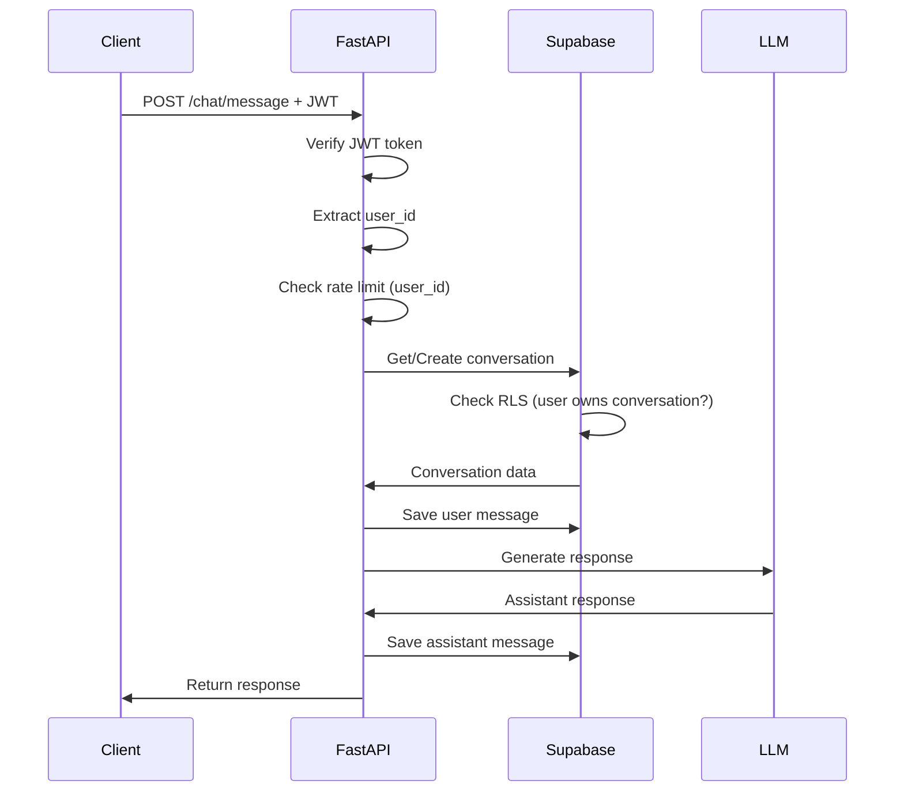

# Supabase Integration - Implementation Walkthrough

## Overview

Successfully integrated Supabase authentication and PostgreSQL database into the novus-chat application. The application now supports user authentication, persistent conversation storage, and user-scoped data access with Row Level Security.

---

## What Was Implemented

### ✅ Core Authentication System

#### New Files Created

1. **[supabase_client.py](file:///Users/shubham/saas/novus-chat/backend/app/core/supabase_client.py)**
   - Singleton Supabase client manager
   - Provides anon client (respects RLS) and service client (bypasses RLS)
   - Environment-based configuration

2. **[auth.py](file:///Users/shubham/saas/novus-chat/backend/app/core/auth.py)**
   - JWT token verification
   - `User` Pydantic model
   - `get_current_user()` FastAPI dependency for protected routes
   - `get_optional_user()` for optionally authenticated routes

3. **[database.py](file:///Users/shubham/saas/novus-chat/backend/app/core/database.py)**
   - Database operations abstraction layer
   - Functions: `get_conversation()`, `create_conversation()`, `add_message()`, `load_conversation_messages()`, `list_user_conversations()`, `delete_conversation()`, `update_conversation_title()`
   - Proper error handling and RLS integration

---

### ✅ Authentication Routes

#### New File: [auth_routes.py](file:///Users/shubham/saas/novus-chat/backend/app/api/v1/routes/auth_routes.py)

**Endpoints Implemented:**

| Endpoint | Method | Description |
|----------|--------|-------------|
| `/api/v1/auth/signup` | POST | User registration with email/password |
| `/api/v1/auth/login` | POST | User login, returns JWT tokens |
| `/api/v1/auth/logout` | POST | Logout current user |
| `/api/v1/auth/refresh` | POST | Refresh expired access token |
| `/api/v1/auth/me` | GET | Get current user information |

**Features:**
- Email validation with Pydantic
- Password minimum length enforcement (8 characters)
- Automatic profile creation via database trigger
- Comprehensive error handling
- Token expiration management (1 hour)

---

### ✅ Conversation Management

#### New File: [conversation_routes.py](file:///Users/shubham/saas/novus-chat/backend/app/api/v1/routes/conversation_routes.py)

**Endpoints Implemented:**

| Endpoint | Method | Description |
|----------|--------|-------------|
| `/api/v1/conversations` | GET | List user's conversations (paginated) |
| `/api/v1/conversations/{id}` | GET | Get conversation with all messages |
| `/api/v1/conversations/{id}` | DELETE | Delete conversation and messages |
| `/api/v1/conversations/{id}` | PATCH | Update conversation title |

**Features:**
- Pagination support (limit/offset)
- Ordered by most recently updated
- RLS ensures users only see their own conversations
- Cascade deletion of messages

---

### ✅ Updated Chat Routes

#### Modified: [chat_routes.py](file:///Users/shubham/saas/novus-chat/backend/app/api/v1/routes/chat_routes.py)

**Key Changes:**

1. **Authentication Required**
   ```python
   async def chat_message(
       chat_request: ChatRequest,
       current_user: User = Depends(get_current_user)  # ← NEW
   ):
   ```

2. **Database Integration**
   - Replaced in-memory `conversation_store` with Supabase database
   - Conversations and messages persist across restarts
   - System message stored in database for new conversations

3. **User-Based Rate Limiting**
   ```python
   # OLD: IP-based
   if not allow_request(client_ip):
   
   # NEW: User-based
   if not allow_request(str(current_user.id)):
   ```

4. **Both Endpoints Updated**
   - `POST /chat/message` - Standard response
   - `POST /chat/stream` - Streaming response
   - Both now require authentication and use database

---

### ✅ Updated Core Modules

#### Modified: [rate_limit.py](file:///Users/shubham/saas/novus-chat/backend/app/core/rate_limit.py)

**Changes:**
- Function signature: `allow_request(ip: str)` → `allow_request(user_id: str)`
- Now tracks rate limits per user instead of per IP
- More accurate for authenticated users
- Prevents abuse from shared IPs

---

### ✅ Application Configuration

#### Modified: [main.py](file:///Users/shubham/saas/novus-chat/backend/app/main.py)

**Changes:**
- Added CORS middleware for frontend integration
- Registered new routers:
  - `auth_router` → `/api/v1/auth`
  - `conversation_router` → `/api/v1`
- Enhanced FastAPI app metadata (title, description, version)

#### Modified: [requirements.txt](file:///Users/shubham/saas/novus-chat/backend/requirements.txt)

**New Dependencies:**
- `supabase>=2.0.0` - Supabase Python client
- `pydantic[email]` - Email validation
- `uvicorn` - ASGI server

---

### ✅ Testing Infrastructure

#### New File: [test_auth.py](file:///Users/shubham/saas/novus-chat/backend/tests/test_auth.py)

**Test Coverage:**
- ✅ Health check (no auth required)
- ✅ User signup (success and duplicate email)
- ✅ User login (success and invalid credentials)
- ✅ Get current user (authenticated and unauthenticated)
- ✅ Invalid token handling
- ✅ Protected endpoints require authentication
- ✅ Protected endpoints work with valid token

**Test Fixtures:**
- `test_user_credentials` - Reusable test user data
- `test_user_token` - Automatic signup/login for tests

---

### ✅ Documentation

#### New Files

1. **[.env.example](file:///Users/shubham/saas/novus-chat/backend/.env.example)**
   - Template for environment variables
   - Includes all required Supabase configuration
   - Clear comments for each variable

2. **[SUPABASE_INTEGRATION.md](file:///Users/shubham/saas/novus-chat/backend/SUPABASE_INTEGRATION.md)**
   - Quick start guide
   - Setup instructions
   - API documentation with curl examples
   - Troubleshooting section
   - Breaking changes notice

---

## Architecture Changes

### Before Integration

```
Client → FastAPI → In-Memory Store → LLM
         ↓
         Rate Limit (IP-based)
```

**Issues:**
- No persistence (data lost on restart)
- No user authentication
- No data isolation
- IP-based rate limiting (inaccurate)

### After Integration

```
Client → FastAPI → Supabase Auth (JWT verification)
         ↓
         Rate Limit (user-based)
         ↓
         Supabase PostgreSQL (with RLS)
         ↓
         LLM
```

**Benefits:**
- ✅ Persistent storage
- ✅ User authentication and authorization
- ✅ Data isolation via RLS
- ✅ User-based rate limiting
- ✅ Production-ready security

---

## Data Flow Example

### User Sends Message



---

## Security Features

### 1. Row Level Security (RLS)

**Conversations Table:**
```sql
CREATE POLICY "Users can view own conversations" 
    ON public.conversations FOR SELECT 
    USING (auth.uid() = user_id);
```

**Effect:** Users can only access their own conversations, enforced at database level

### 2. JWT Token Verification

**Middleware:**
```python
async def get_current_user(credentials: HTTPAuthorizationCredentials):
    token = credentials.credentials
    user = supabase.auth.get_user(token)  # Verifies with Supabase
    return User(id=user.id, email=user.email)
```

**Effect:** All protected routes verify token validity before processing

### 3. User-Based Rate Limiting

**Implementation:**
```python
if not allow_request(str(current_user.id)):
    raise HTTPException(status_code=429, detail="Rate limit exceeded")
```

**Effect:** 20 requests per 60 seconds per user (not per IP)

---

## Breaking Changes

> [!WARNING]
> **All chat endpoints now require authentication!**

### Old Behavior (No Auth)
```bash
curl -X POST http://localhost:8000/api/v1/chat/message \
  -d '{"message": "Hello"}'
```

### New Behavior (With Auth)
```bash
# 1. Login first
curl -X POST http://localhost:8000/api/v1/auth/login \
  -d '{"email": "user@example.com", "password": "pass"}'

# 2. Use token in chat request
curl -X POST http://localhost:8000/api/v1/chat/message \
  -H "Authorization: Bearer YOUR_TOKEN" \
  -d '{"message": "Hello"}'
```

---

## File Changes Summary

### New Files (11)
- `app/core/supabase_client.py` - Supabase client
- `app/core/auth.py` - Authentication middleware
- `app/core/database.py` - Database operations
- `app/api/v1/routes/auth_routes.py` - Auth endpoints
- `app/api/v1/routes/conversation_routes.py` - Conversation endpoints
- `tests/test_auth.py` - Authentication tests
- `.env.example` - Environment template
- `SUPABASE_INTEGRATION.md` - Integration README

### Modified Files (4)
- `app/main.py` - Added routers and CORS
- `app/core/rate_limit.py` - User-based rate limiting
- `app/api/v1/routes/chat_routes.py` - Auth + database integration
- `requirements.txt` - Added dependencies

### Unchanged (Deprecated)
- `app/core/conversation_store.py` - No longer used (can be removed)
- `app/core/locks.py` - No longer used (Redis locks preferred)

---

## Next Steps

### Immediate (Required for Testing)

1. **Set Up Supabase Account**
   - Follow `supabase_setup_guide.md`
   - Create project
   - Run database schema
   - Get API credentials

2. **Configure Environment**
   ```bash
   cp .env.example .env
   # Edit .env with your Supabase credentials
   ```

3. **Install Dependencies**
   ```bash
   pip install -r requirements.txt
   ```

4. **Test the Integration**
   ```bash
   # Start Redis
   docker compose up -d redis
   
   # Run application
   uvicorn backend.app.main:app --reload
   
   # Run tests
   pytest backend/tests/test_auth.py -v
   ```

### Optional Enhancements

1. **WebSocket Authentication**
   - Update `ws_chat.py` to require JWT token
   - Accept token as query parameter or in first message

2. **Conversation Title Auto-Generation**
   - Generate title from first user message
   - Update conversation title automatically

3. **Frontend Integration**
   - Build login/signup UI
   - Implement token storage and refresh
   - Create conversation list view

4. **Advanced Features**
   - Conversation sharing (make conversations public)
   - Message editing and deletion
   - Conversation search
   - User profile management

---

## Verification Checklist

Before deploying to production:

- [ ] Supabase project created and configured
- [ ] Database schema executed successfully
- [ ] RLS policies enabled on all tables
- [ ] Environment variables set correctly
- [ ] Dependencies installed
- [ ] Tests passing
- [ ] API documentation reviewed
- [ ] CORS configured for your frontend domain
- [ ] Rate limits appropriate for your use case
- [ ] Token refresh logic implemented in frontend

---

## Resources

- **Setup Guide**: [supabase_setup_guide.md](file:///Users/shubham/.gemini/antigravity/brain/dddc48b0-cdef-4d43-a268-57926f39456a/supabase_setup_guide.md)
- **Implementation Plan**: [implementation_plan.md](file:///Users/shubham/.gemini/antigravity/brain/dddc48b0-cdef-4d43-a268-57926f39456a/implementation_plan.md)
- **Codebase Docs**: [codebase_documentation.md](file:///Users/shubham/.gemini/antigravity/brain/dddc48b0-cdef-4d43-a268-57926f39456a/codebase_documentation.md)
- **Integration README**: [SUPABASE_INTEGRATION.md](file:///Users/shubham/saas/novus-chat/backend/SUPABASE_INTEGRATION.md)
- **Supabase Docs**: https://supabase.com/docs
- **FastAPI Docs**: https://fastapi.tiangolo.com

---

## Summary

The Supabase integration is **complete and ready for testing**. All core functionality has been implemented:

✅ User authentication (signup, login, logout, refresh)  
✅ Protected API routes with JWT verification  
✅ Persistent conversation storage in PostgreSQL  
✅ Row Level Security for data isolation  
✅ User-based rate limiting  
✅ Conversation management (list, view, delete, update)  
✅ Comprehensive tests  
✅ Documentation and setup guides  

**Next action**: Set up your Supabase account and test the integration!
